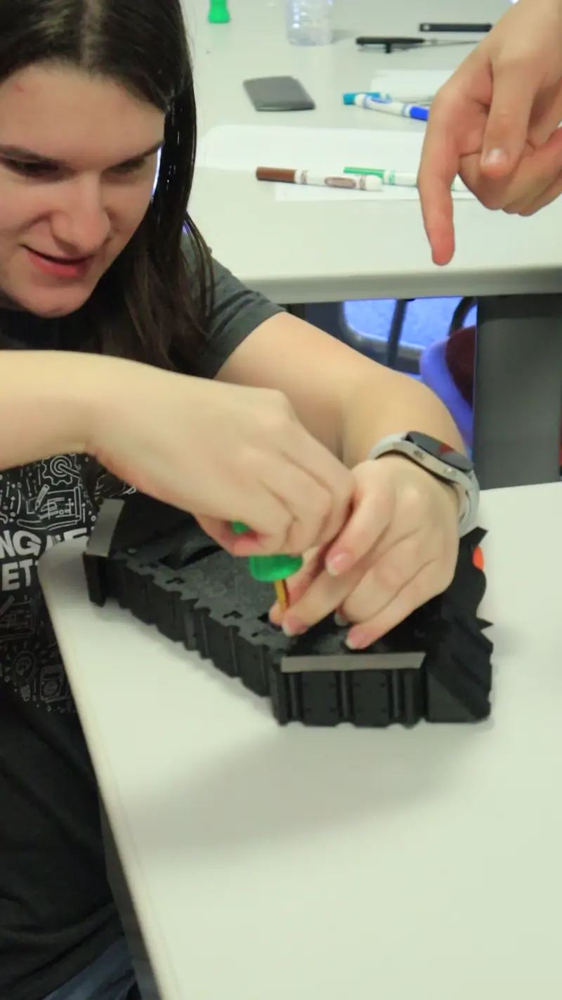
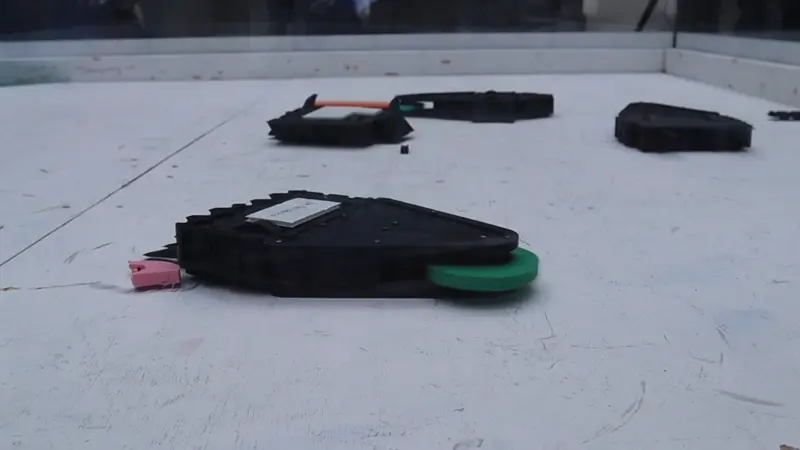
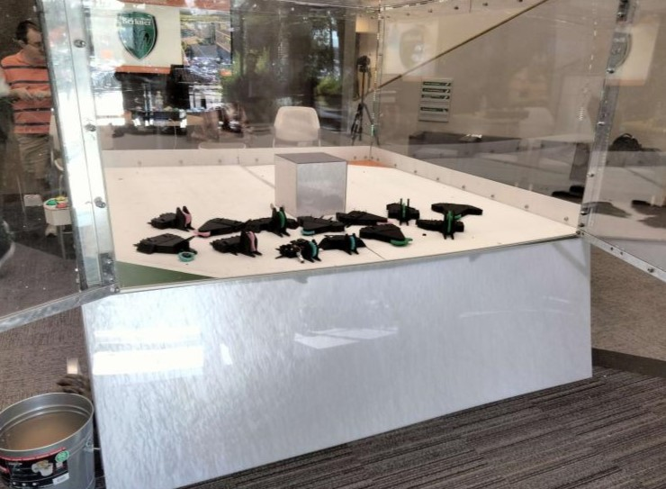
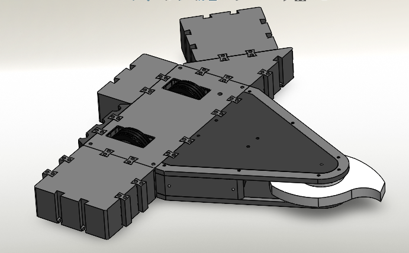
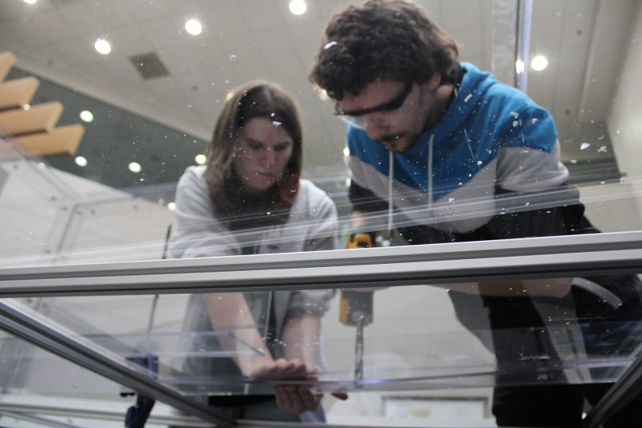

Combat Blocks is a project I'm incredibly proud of. I led the development of a modular combat robot system designed to engage and inspire high school students through hands-on robotics workshops. With my team, we created unique robot building blocks, including seven weapon and seven armor attachments, all designed to be quickly and easily connected using a grid-dovetail system. Our modular design allows robots to break at connection points, enabling parts to be reused even after taking a hit. We leveraged 3D printing technology to achieve rapid development and sustainability, producing approximately 900 parts on a budget of $3,000.

We hosted nine workshops, each attended by 40-60 high school students, where we taught them to design, build, and compete with their custom robots. Seeing their engagement and enthusiasm grow was incredibly rewarding, and it led to a threefold increase in school requests for future workshops. We even presented our robots to Tech Titans of Dallas, becoming finalists for the "Tech Titans of the Future" award, which highlighted the project's impact on promoting STEM education and inspiring the next generation of engineers and innovators.

---

##### The Tech-Titans Panel (Pre-Workshop)
Me speaking to the highschoolers about transitioning from highschool to college, and finding your passion.

##### Assembly
Showing a team the screw placement for their robot.

##### Animation of the Robots
2v2 robot combat chaos unfolding.

##### Student Built Bots
After the high schoolers leave, we usually take an opportunity to take a photo of the bots they created and the aftermath!

##### Combat Blocks CAD
One of the several test assemblies to ensure configurations would work together.

##### Battlebox
A large part of putting on our first workshop was getting our 8'x8' battlebox built. Construction of the Battlebox was thoroughly thought out and used incredible bent polycarb corners to create a nearly seamless viewing experience inside.
