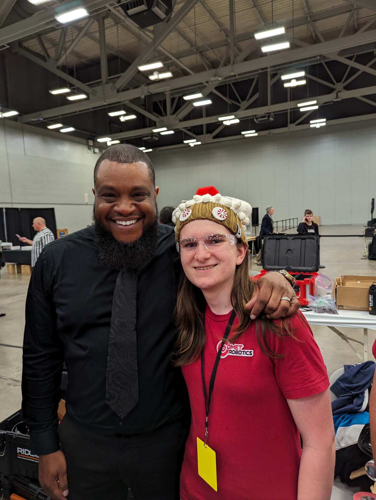
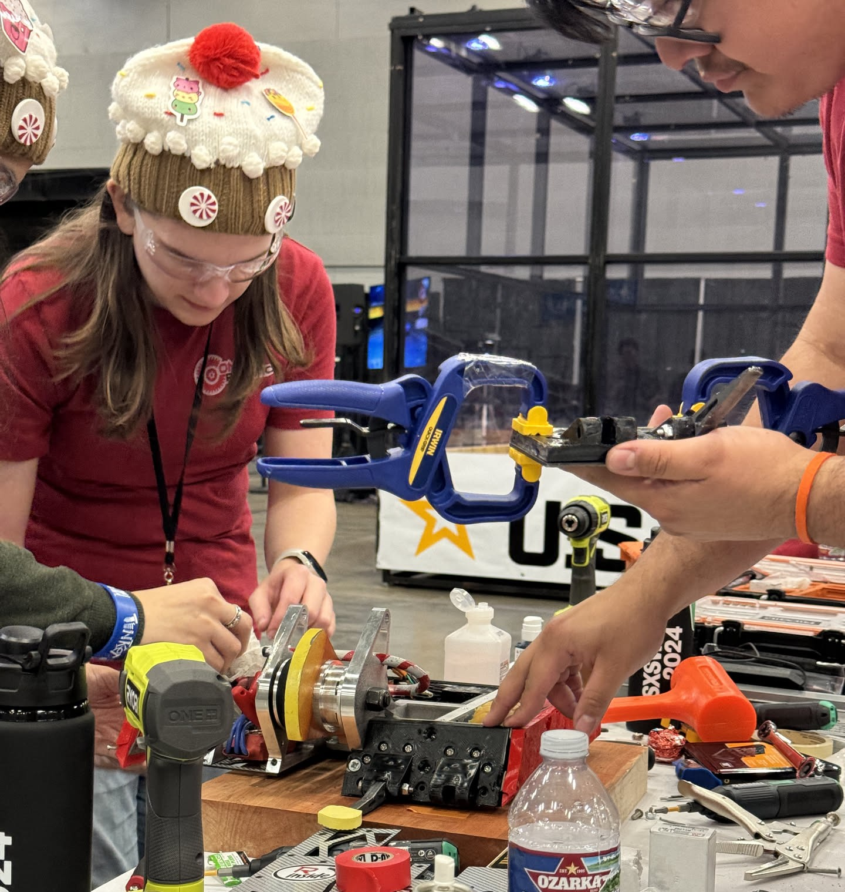
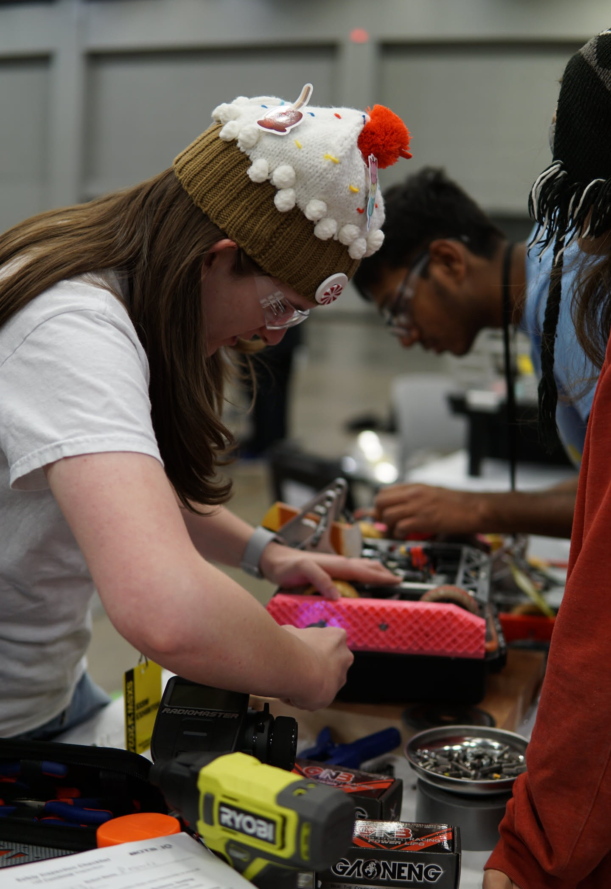

> Desserts is "Stressed" backwards, following a UTD convention of naming things backwards

Desserts is a 15/12lb robot designed for the 2024 Bots IQ competition held at SXSW in Austin. Desserts is ambitious in scale, and with a deadline of just 3 weeks it took a dedicated team to get it competition ready. Om Davra was the lead designer for Desserts, with tasks being delegated to both myself and Jaime. I was tasked with making the drivetrain for Desserts based on key dimensions we had come up with as a group. I designed custom molded wheels for Desserts shaped like macarons, with a mix of 40A and 50A urethane. Desserts uses a belted drivetrain and planetary gearboxes for drive, with soft TPU side armor. 

---

  

    

      <iframe 
        src="/assets/Desserts%20Render/Data/index.html"
        width="100%"
        height="450px"
        style="border: none;" 
        allowfullscreen="true"
        background-color="#3c3c3d"
        >
      </iframe>
    

  

##### Getting Desserts to the competition
Reprogramming ESCs at 3AM gets to you, but it's cause for celebration when it works!

Meeting Faruq from Battlebots was a dream come true.

##### Getting Desserts ready for the next match

##### What's next?
Desserts is expected to go to NHRL on April 5th as a 12lber.