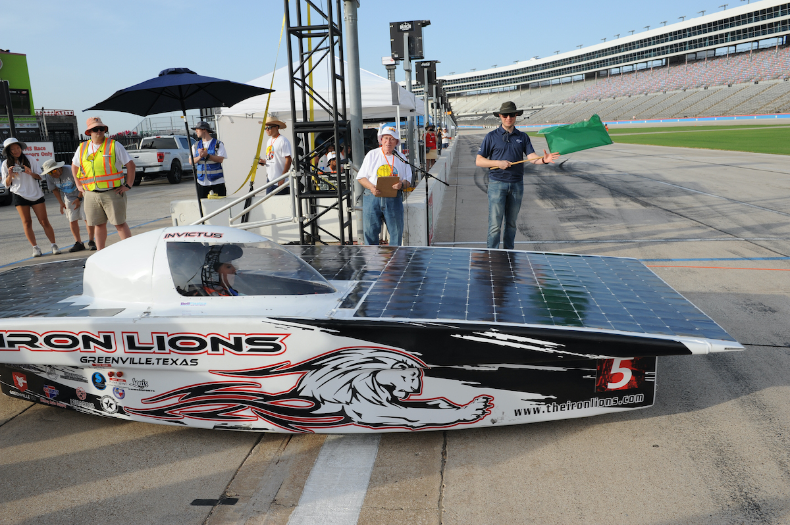
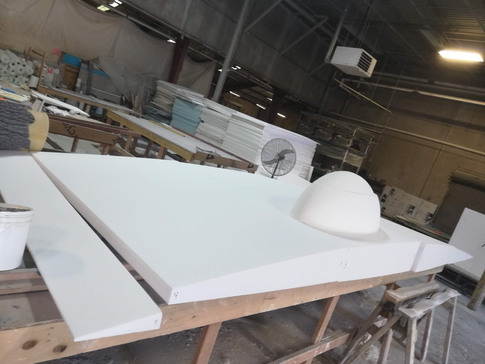
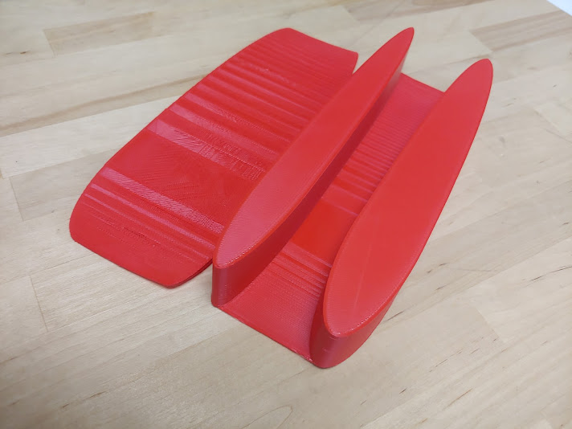

The Greenville HS Solar Car team had an ambitious goal of being the highschool to make a modern, mono-hull solar car. I was tasked with creating the initial outer hull in the shape of a tear drop and creating the "plug" for the mold. To ensure success, I ran several simulations of my design including flow and FEA analysis. 

Printed models were also made and were put in a rough wind tunnel the team had made. I later worked with the designer tasked with making the chromoly tube subframe and integrating the driver seat. The foam was cut from a 4'x4'x8' foam block in multiple parts. The parts were joined, plastered, then sanded multiple times to ensure a smooth surface finish with no sharp edges. The model was then turned into the mold with help from Stromberg's. From the mold, carbon fiber was laid up to create the final shell. The solar car team successfully competed with it a year later, setting a record for the first highschool solar car team to do what previously only the best collegiate solar car teams had done.

---

##### The new solar car "Invictus" at the track

##### The Foam Model Being Staged Before Assembly

##### Early 3D Printed Model

