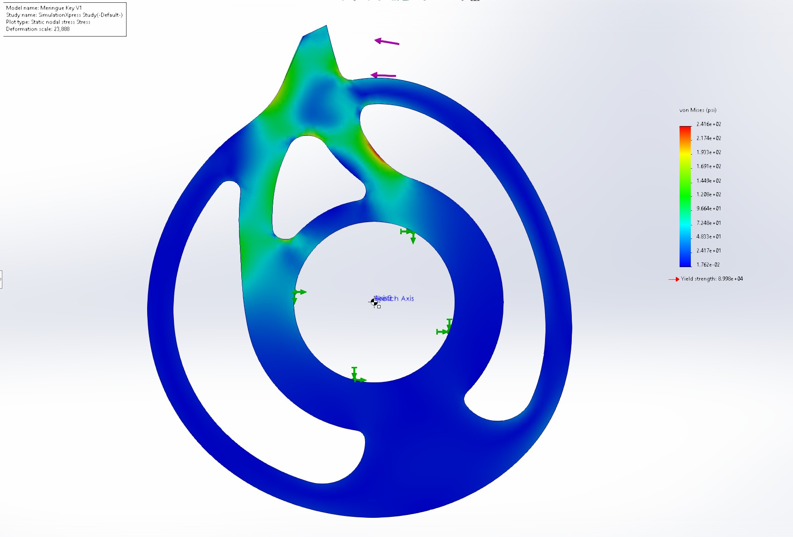

##### 3lb Impulse

3lb Impulse is the first Beetle from Comet Robotics and is an evolution from my Plant, Impulse. 3lb Impulse uses a unique 'thagomizer' style design with a beefy wedge in front and a fast tail with a horizontal spinner. 

Impulse was designed from the ground up to be competitive. I selectively used my limited budget on great materials, sticking with 3D printing to bring down the cost of some components. I used FEA analysis to ensure the weapon geometry would hold up with no obvious stress risers, and I prototyped my design often. I iterated using 3D printed models and tested wheel molds before committing to a final design. The UHMW tails were machined locally, along with the titanium weapon shaft.

Impulse uses custom molded tires made of 20A urethane for unparalleled grip. It's thick TPU wedge made it a tank of a robot, shrugging off even the strongest hits. It's thick UHMW tail was both lightweight and shock absorbent, and held up extremely well. When Impulse was handling well, it could push opponents around and dish out wicked fast hits. 

3lb Impulse had a positive win ratio and went toe-to-toe with high profile beetles at competition. Ultimately, Impulse was held back by an undersized weapon motor and poor drive handling.

---

##### Meringue

  

    

      <iframe 
        src="/assets/Meringue%20Render/Data/index.html"
        width="100%"
        height="450px"
        style="border: none;" 
        allowfullscreen="true"
        background-color="#3c3c3d"
        >
      </iframe>
    

  

Following the dessert themed branding of our April 2025 NHRL bid, Meringue is a spiritual Impulse V2. Boasting an upgraded design, aesthetics, and electronics, Meringue is the culmination of hundreds of hours of work designing, testing, and fighting combat robots.

However, Meringue debuted with a dissapointing opening at the April NHRL. I've been working on collecting feedback from others about the design and what went wrong at competition. Meringue's critical design flaw is overestimation of both weapon size and tail material. The tails on Meringue are CNC machined UHMW plastic and the weapon is lasercut 5mm AR600 steel. Both of these materials are plenty strong and will be just fine with more agressive pocketing. By lowering the weapon and tail weight totals, I can add in parts that were planned for Meringue but had to be scrapped to make weight. With more time and more iteration on components, Meringue will be a force to be reckoned with. 

