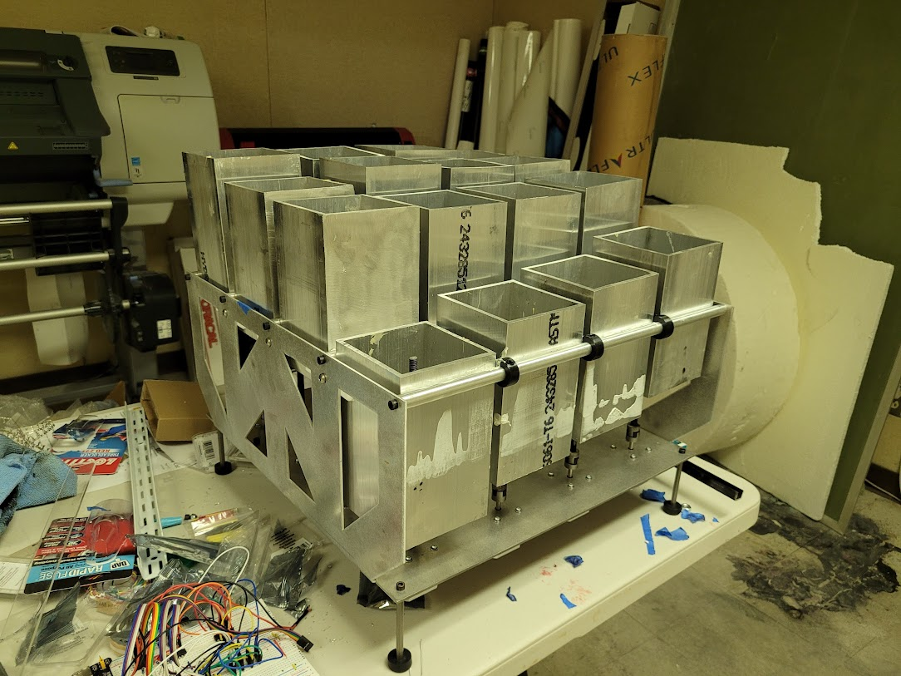

Getting inspiration from programmable metal stamping machines that use several linear actuators in a grid to create stamped sheet metal without one-off tooling, I embarked on a several month long project to design and build a 2.5-D molding machine. Using a similar design of linear actuators in a grid, 3D printed toppers could be attached to the tops of the actuators to create detailed topography without wasted support material. I worked with a partner, who created a program for importing 3D models, generating G-Code, and controlling the machine. 

The final prototype was capable of creating a dome using less material and in less time. I used 3D printing, sheetmetal, extrusion, and modular design techniques to make an easily assembleable machine with many repeating components. I also coded the arduino based control system, and made a custom carrier board for the stepper motor drivers.

---

##### Animation
The machine with the test dome (in red) model in CAD.

##### Early physical prototype
This early proof of concept was made with mostly scrap materials and was a proof of concept for the electronics, programming, and design of the later improved model.
