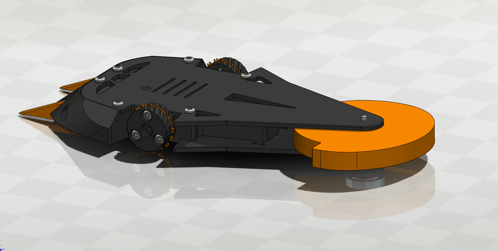
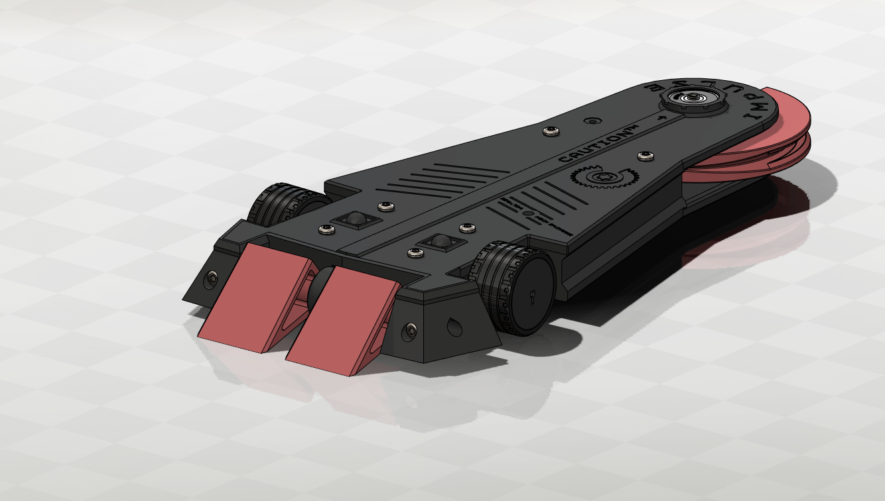
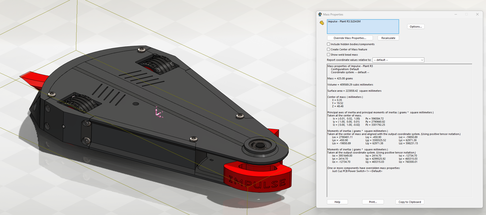

##### Plant Impulse V1
My first combat robot was a fully 3D printed, 1lb combat robot. The design philosophy of Impulse is to use a very fast spinning weapon at the end of a tail that can be whipped around to hit the side of an opponent with high engagement speed. It's big front wedge was able to take serious hits from opponents, and it effectively defeated many opponents in competition. Impulse would get a revision every 1-3 competitions, making it highly effective thanks to iterative design. As the first successfully fought combat robot in the club, it was used as a template for many more plastic antweights. It also became my 3lb full combat robot later on.

##### Plant Impulse V2

##### Plant Impulse V3
