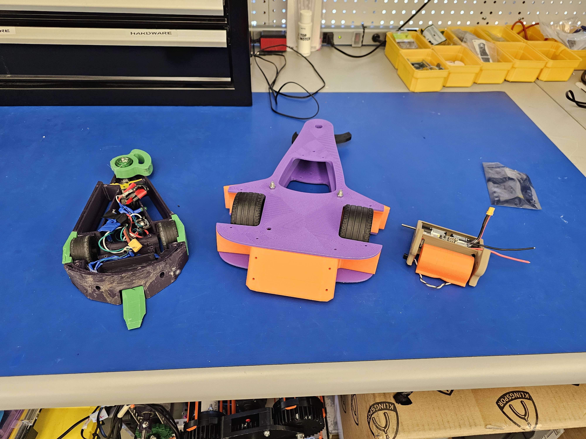
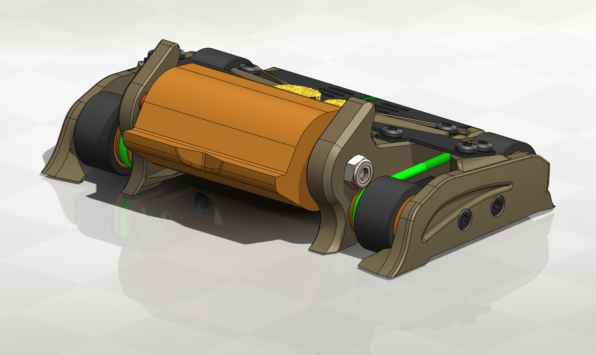
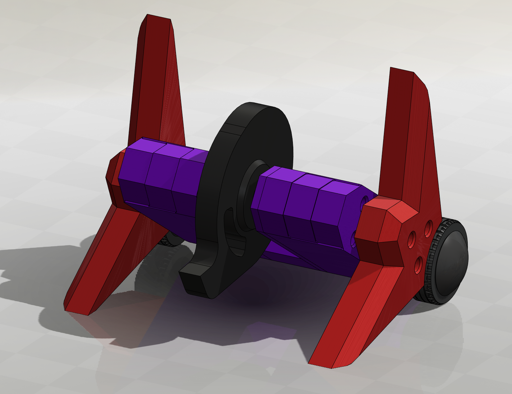
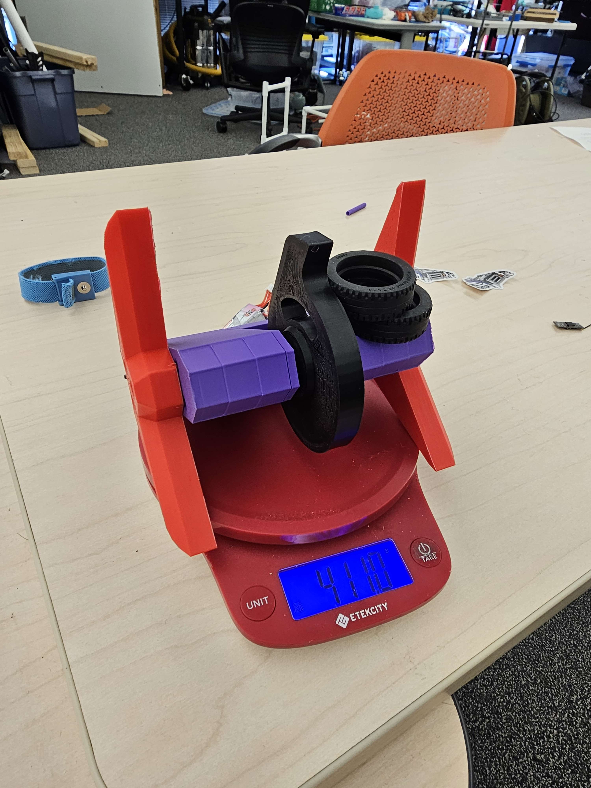

> Plastic Antweights are fully 3D Printed 1lb combat robots

##### Workshops
Over 4 semesters I hosted workshops to more than 300 students at UTD, teaching them the basics of robotics, combat robotics, and CAD. In these workshops, I moved through the strategies in combat robotics, how to design a combat robot, and finally 3D printing a design and putting it together. The plant workshops were extremely successful, starting with just 15 or so members in summer of 2023, we grew that number to over 150 by Fall 2024. Over these semesters, I also made several of my own plants. Each plant has a story, so I compiled them on this page.

---
#### My Robots

##### Ramsey
Ramsey is a multibot consisting of 2, half pound robots Ram and Sey. Ramsey is named after my friend's cat. Despite it's cute connection, both Ram and Sey feature full size plastic antweight weapons. Ask any combat robot builder and they will tell you how difficult it is to create a plant multibot. Ramsey is one of my most weight optimized robots, since even half a gram is critical. Both Ram and Sey went through 10 iterations each before their first competition, TRC. At TRC they placed in the top 8 with a 3-2 record. Ramsey was accompanied by 2 other multibot competitors at TRC, but both did not have any spinning weapons, they were simple unibody control bots made to be durable and to push around their opponent. This is because more than 1/3 of Ramsey's weight is in the weapon systems, making drive ability and chassis design difficult. Ramsey was durable for what it was though, ripping apart opponents literally twice it's weight. In the end, Ramsey lost in the quarter finals to a control bot named Higher Education, which has incredible drive ability and ground game for a plant. Despite having an undercutter, Ramsey was unable to deal meaningful damage to it's opponent, and lost by judges decision based on Higher Education's control in the match.

##### DotIO

  

    

      <iframe 
        src="/assets/DotIO%20Render/Data/index.html"
        width="100%"
        height="450px"
        style="border: none;" 
        allowfullscreen="true"
        background-color="#3c3c3d"
        >
      </iframe>
    

  

DotIO is a Plant 4wd vertical spinner. It hits extremely hard with an "all reach, no control" strategy. The weapon reaches so far in front of the robot DotIO would sometimes do front flips just spinning up the weapon! V1 was a very large robot, which meant that it was not very dense. This was fixed in V2 where DotIO got a very compact make-over and a geared drivetrain. Using printed gears, it's one of the few Plants with true 4wd making it fast and agile around the box.
(DotIO V2 Pictured)

---

##### Xiba
Xiba is an ultra-compact drum spinner with incredible looks. Coming in nearly 100 grams underweight, Xiba uses it's small size and high density to consistently deal out damage to it's opponents. Xiba uses a polyurethane belted drivetrain, a 140 gram drum, and Mayan ruin aesthetics.

Xiba size comparison to Plant Impulse and an early 3lb Impulse mock up.

Xiba's final CAD form.

---

##### Isodope
Isodope is a nearly perfectly symmetrical vertical spinner. It's oversized weapon was excellent at  dishing out big hits, and it's forks were extremely effective and bullying opponents. Isodope's achilles heel was the staged construction. Relying on clamping pressure from plastic threading screws resulted in spectacular failure when the strength of the threads were overcome.

Isodope being weighed in.

##### Controller
WIP
##### mmmre
WIP
##### Uppercut
WIP